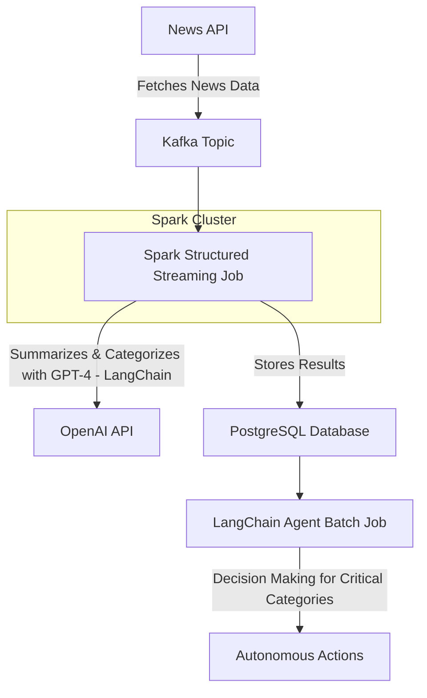

# 📰 Real-Time News Processing Pipeline

This project implements a **real-time news processing pipeline** that ingests news articles from News API, summarizes the content, categorizes the news into one of several categories (sports, pharma, technology, banking, startups, terrorism, or unknown), and autonomously takes decisions using LangChain agents for critical categories (e.g., banking, terrorism).

It uses **Kafka** for streaming ingestion, **Spark Structured Streaming** for real-time processing, **OpenAI (via LangChain)** for summarization and categorization, and **PostgreSQL** as the data warehouse.

---

## 🚀 Features

✅ Real-time news ingestion from News API  
✅ Kafka-based data streaming pipeline  
✅ Spark Streaming job for summarization and categorization  
✅ Integration with OpenAI GPT-4 (via LangChain) for robust summarization and classification  
✅ Autonomous agents to handle critical categories like banking and terrorism  
✅ PostgreSQL integration for storing processed data  
✅ Docker Compose support for easy local setup

---

## 📊 Architecture



## 🛠️ Tech Stack
Kafka: For real-time streaming ingestion

Spark Structured Streaming: For real-time data processing

LangChain + OpenAI GPT-4: For summarization and categorization

PostgreSQL: For data persistence

Docker Compose: For local environment setup

Python: Main programming language

## ⚡ Getting Started

### 1. Clone the Repository

```bash
git clone https://github.com/srikantvadrevu/real-time-summarization.git
cd real-time-news-pipeline
```

### 2. Install Python Dependencies
```bash
pip install -r requirements.txt
```
### 3. Start Kafka and PostgreSQL with Docker Compose
```bash
docker-compose up -d
```
### 4. Download the PostgreSQL JDBC Driver
```bash
wget https://jdbc.postgresql.org/download/postgresql-42.7.3.jar
```
### 5. Start the Kafka Producer
```bash
python kafka_producer/producer.py
```
### 6. Start the Spark Streaming Job
```bash
spark-submit \
    --jars /full/path/to/postgresql-42.7.3.jar \
    spark_jobs/news_streaming.py
```
### 7. Run the LangChain Agent Batch Job
```bash
spark-submit \
    --jars /full/path/to/postgresql-42.7.3.jar \
    spark_jobs/terrorism_batch_job.py
```


---

## 🧪 Sample Data Flow

1. Producer script fetches latest news from News API and sends JSON to a Kafka topic:
    ```json
    {
      "title": "Sample News Title",
      "content": "Sample news article content...",
      "url": "https://news.example.com/article"
    }
    ```
2. Spark Streaming consumes messages from Kafka, uses OpenAI GPT-4 (via LangChain) to:
    - Summarize the content
    - Categorize into predefined categories
3. Results stored in PostgreSQL:
    - `title`, `summary`, `category`, `url`, `timestamp`
4. Spark batch jobs pick up specific categories (e.g. terrorism) and use LangChain agents to autonomously decide next actions.

---

## 📂 Project Structure

```
real-time-summarization/
│
├── kafka_producer/
│   └── producer.py
│
├── spark_jobs/
│   ├── news_streaming.py
│   ├── terrorism_batch_job.py
│
├── agents/
│   ├── banking_agent.py
│   └── terrorism_agent.py
│
├── tools/
│   ├── banking_tools.py
│   └── terrorism_tools.py
│
├── docker-compose.yml
├── requirements.txt
└── README.md
```

### 🚀 Future Improvements
* 🛡️ Add authentication and encryption (OAuth2, SSL)

* 📈 Integrate with Prometheus + Grafana for monitoring

* 🖼️ Add Streamlit dashboard for visualizing results

* ☁️ Deploy on Kubernetes for production readiness

* 🧪 Add unit tests and CI/CD pipelines

* 🗂️ Expand categories and improve classification accuracy

